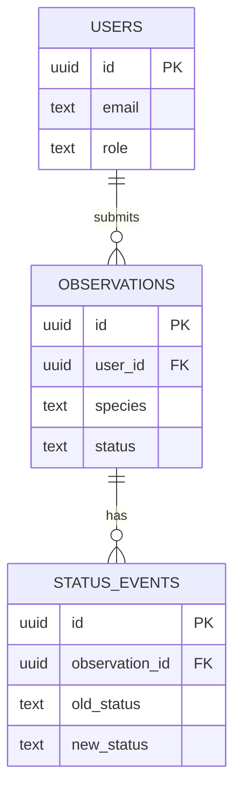

# Map

## Request flow — Community Engagement

```
Contributor -> POST /observations         -> services/observations.create_observation      -> observations table
Contributor -> GET  /observations/mine    -> services/observations.list_own_observations    -> observations table
Staff       -> GET  /observations         -> services/observations.list_all_observations    -> observations table
Staff       -> PATCH /observations/{id}   -> services/observations.update_observation_status -> observations + status_events tables
                                                                                              -> services/notifications.notify_contributor (no-op)
```

## Auth flow

1. Frontend signs in via Supabase Auth (`frontend/src/lib/supabaseClient.ts`) and gets a JWT.
2. Frontend sends `Authorization: Bearer <jwt>` to the FastAPI backend.
3. `app/core/auth.py::get_current_user` validates the JWT against Supabase Auth (`supabase.auth.get_user`) and reads `role` from `public.users`.
4. `require_role(*roles)` (see `app/routers/community.py::require_staff_or_researcher`) rejects with 403 if the caller's role isn't in the allowed set.

## Database schema



`users.id` is a foreign key to `auth.users(id)` — a Postgres trigger (`handle_new_auth_user`) inserts a `public.users` row automatically on signup, defaulting `role` to `contributor`. Staff/researcher roles are granted manually (no self-service upgrade path yet).

RLS is enabled on all three tables; policies currently allow a user to read/insert only their own rows. Staff-wide access goes through the FastAPI backend (service-role key), not direct Supabase queries from the frontend.

## Consumed by frontend

- `POST /observations`, `GET /observations/mine` — contributor's submission form + "my submissions" view.
- `GET /observations`, `PATCH /observations/{id}` — staff triage dashboard.

See `frontend/` (no `map.md` there yet).
