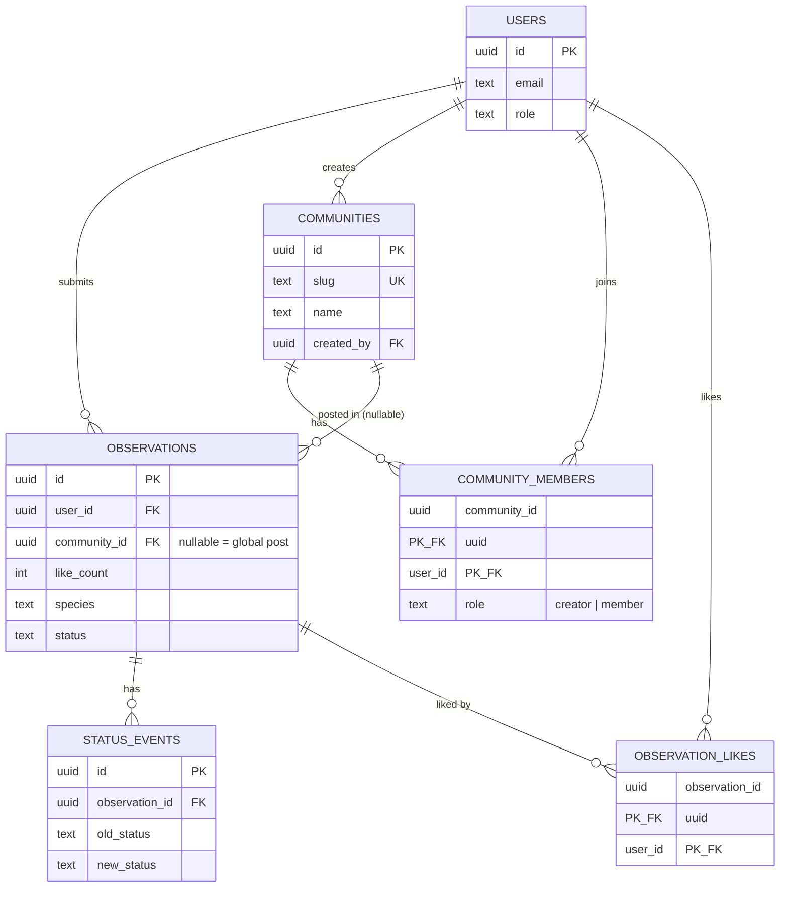

# Map

## Request flow — Community Engagement

```
Contributor -> POST /observations         -> services/observations.create_observation      -> observations table
Contributor -> GET  /observations/mine    -> services/observations.list_own_observations    -> observations table
Staff       -> GET  /observations         -> services/observations.list_all_observations    -> observations table
Staff       -> PATCH /observations/{id}   -> services/observations.update_observation_status -> observations + status_events tables
                                                                                              -> services/notifications.notify_contributor (no-op)
Any user    -> POST/DELETE /observations/{id}/like -> services/likes.*                        -> observation_likes + observations.like_count
```

## Request flow — Communities

```
Any user  -> POST /communities                 -> services/communities.create_community      -> communities + community_members tables
Any user  -> GET  /communities                 -> services/communities.list_communities       -> communities table
Any user  -> GET  /communities/{slug}           -> services/communities.get_community_by_slug  -> communities table
Any user  -> POST /communities/{slug}/join      -> services/communities.join_community         -> community_members table
Any user  -> DELETE /communities/{slug}/leave   -> services/communities.leave_community        -> community_members table
Any user  -> GET  /communities/{slug}/feed      -> services/observations.list_community_feed   -> observations table
Member    -> POST /observations (+community_slug) -> services/observations.create_observation  -> observations + community_members (membership check)
```

Global posts (`observations.community_id IS NULL`) appear in every community's `/feed`, including communities created after the post. Posting *in* a specific community (not globally) requires membership — enforced in `services/observations.create_observation`, 403 otherwise. "Invite via link" needs no dedicated table: communities are public/open-join, so an invite is just sharing `/communities/{slug}`.

Images: the frontend uploads directly to the `observation-images` Supabase Storage bucket (public read, authenticated write) and passes the resulting URL as `media_url` — no backend upload endpoint.

## Auth flow

1. Frontend signs in via Supabase Auth (`frontend/src/lib/supabaseClient.ts`) and gets a JWT.
2. Frontend sends `Authorization: Bearer <jwt>` to the FastAPI backend.
3. `app/core/auth.py::get_current_user` validates the JWT against Supabase Auth (`supabase.auth.get_user`) and reads `role` from `public.users`.
4. `require_role(*roles)` (see `app/routers/community.py::require_staff_or_researcher`) rejects with 403 if the caller's role isn't in the allowed set.

## Database schema



`users.id` is a foreign key to `auth.users(id)` — a Postgres trigger (`handle_new_auth_user`) inserts a `public.users` row automatically on signup, defaulting `role` to `contributor`. Staff/researcher roles are granted manually (no self-service upgrade path yet).

RLS is enabled on all tables; policies currently allow a user to read/insert only their own rows (communities are the exception — publicly readable, since they're meant to be browsable). Staff-wide access goes through the FastAPI backend (service-role key), not direct Supabase queries from the frontend.

## Consumed by frontend

- `POST /observations`, `GET /observations/mine` — contributor's submission form + "my submissions" view.
- `GET /observations`, `PATCH /observations/{id}` — staff triage dashboard.
- `POST /communities`, `GET /communities` — create/browse communities.
- `POST /communities/{slug}/join`, `DELETE /communities/{slug}/leave` — join/leave button.
- `GET /communities/{slug}/feed` — a community's post feed.
- `POST /observations/{id}/like`, `DELETE /observations/{id}/like` — like button toggle.

See `frontend/` (no `map.md` there yet).
