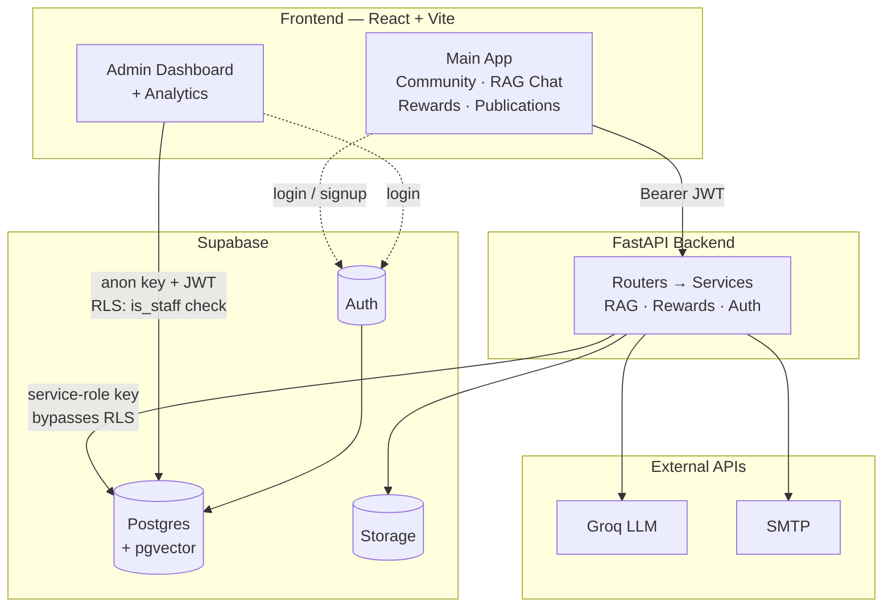

# System Architecture — Diagram + Tech Stack

## Architecture Diagram (Mermaid)

Kept to ~9 nodes / short labels specifically so it renders legibly at
slide size — paste into [mermaid.live](https://mermaid.live) to export as
an image for the deck.

**Read it as two distinct paths, not one:** the main app never talks to
Postgres directly — everything goes through FastAPI using a trusted
service-role key, with authorization enforced in Python. The admin
dashboard talks to Postgres **directly** from the browser using the anon
key and the logged-in admin's own session, authorized entirely by Postgres
Row-Level Security (`is_staff()`). Auth itself (signup/login/session) is
handled by Supabase Auth directly from both frontends — the backend only
ever validates the JWT it's handed.

## Tech Stack

**Frontend** — React 19, Vite, React Router v6 (auto-discovered routes),
Tailwind CSS v4, `@supabase/supabase-js`, lucide-react

**Backend** — FastAPI, Uvicorn, Pydantic, supabase-py, Groq SDK,
sentence-transformers (local embeddings), pypdf, smtplib

**Data / Infra** — Supabase Postgres, pgvector, Supabase Auth, Supabase
Storage, Groq API (`openai/gpt-oss-120b`), Gmail SMTP

## One-line summary per layer

- **Frontend** — one React SPA, two access patterns (contributor app vs.
  staff-only admin section)
- **Backend** — thin routers, all logic in services, one shared Pydantic
  contract file
- **Database** — single Postgres instance: relational data + vector
  search (pgvector) in one place, no separate vector DB
- **RAG** — local embeddings for retrieval, Groq for generation, grounded
  in BNHS's real ingested content (Hornbill, JBNHS, newsletters, blog,
  Virtual Museum)
- **Security** — service-role trust boundary for the main app, real RLS
  for the admin app — not the same model reused blindly in both places
