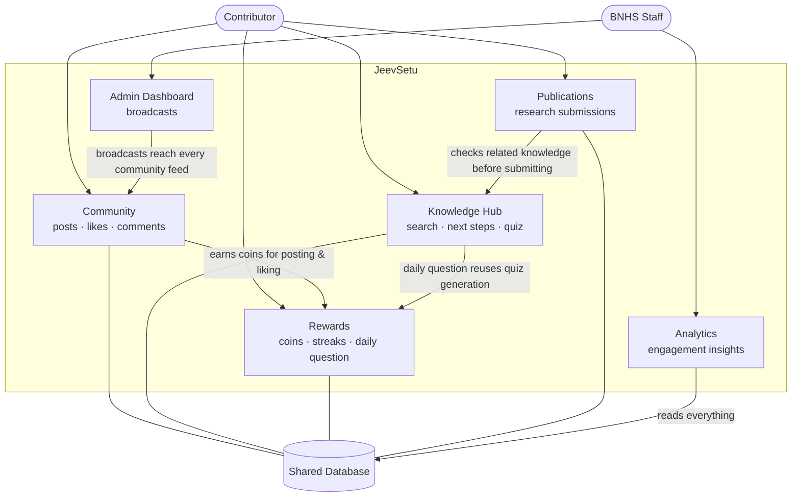
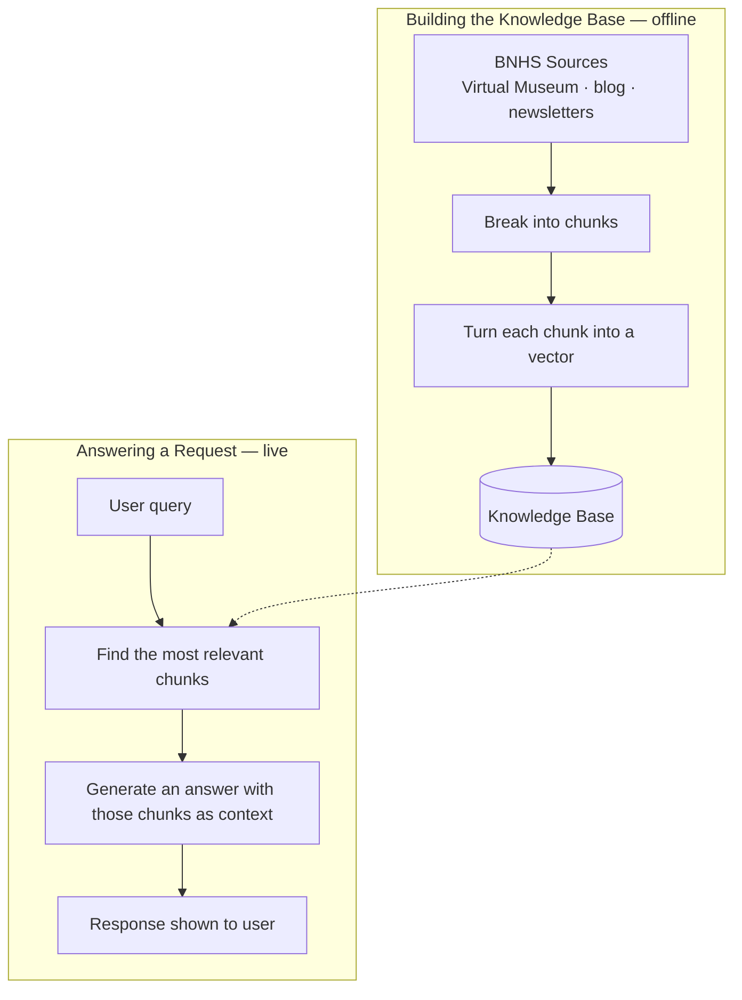

# System Architecture — Diagrams

Two diagrams: how the features connect to each other, and a separate
close-up of the RAG pipeline. Paste either into
[mermaid.live](https://mermaid.live) to export as an image for the deck.

## 1. How the Features Connect

**How to read it:** every feature is a lens on the same shared data, not a
separate app. A contributor's actions in one feature ripple into another —
posting earns coins (Rewards), answering the daily question reuses the
Knowledge Hub's quiz engine, and a research submission checks itself
against the same knowledge base a user would search manually. Staff-side,
Admin and Analytics sit on top of the same data the contributor features
write to — a broadcast posted from Admin shows up directly in every
community's feed, and Analytics is simply a read-only view over everything
else happening in the system.

## 2. RAG Pipeline

Two separate flows: building the knowledge base (offline, one-time/batch),
and answering a live request (online, per query).

**The same two building blocks, used three different ways:**

| Feature | Retrieve? | Generate? | What happens |
|---|:---:|:---:|---|
| **Search** | Yes | No | Finds and returns real BNHS source documents — fastest, always grounded |
| **Next Steps** | No | Yes | Suggests 4 follow-up actions based on what the user is already reading |
| **Quiz** | Yes | Yes | Retrieves relevant facts, then generates questions grounded in them |
| **Daily Question** | Yes | Yes | Same as Quiz, one question, generated once per day and cached |
| **Publications check** | Yes | No | Same as Search, reused to show a researcher what BNHS already has before they submit |

Search and Next Steps use only one half of the pipeline each; Quiz is the
only one where retrieval directly shapes what gets generated; Daily
Question is just Quiz scheduled and cached; the Publications check is
literally the Search feature called from a different screen.
